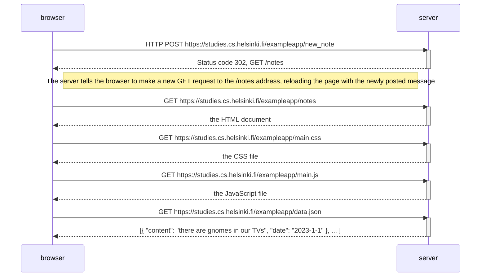

```mermaid
sequenceDiagram
  participant browser
  participant server
  
  browser->>server: HTTP POST https://studies.cs.helsinki.fi/exampleapp/new_note
  activate server
  server-->>browser: Status code 302, GET /notes
  deactivate server
  
  Note right of browser: The server tells the browser to make a new GET request to the /notes address, reloading the page with the newly posted message

  browser->>server: GET https://studies.cs.helsinki.fi/exampleapp/notes
  activate server
  server-->>browser: the HTML document
  deactivate server

  browser->>server: GET https://studies.cs.helsinki.fi/exampleapp/main.css
  activate server
  server-->>browser: the CSS file
  deactivate server

  browser->>server: GET https://studies.cs.helsinki.fi/exampleapp/main.js
  activate server
  server-->>browser: the JavaScript file
  deactivate server
  
  browser->>server: GET https://studies.cs.helsinki.fi/exampleapp/data.json
  activate server
  server-->>browser: [{ "content": "there are gnomes in our TVs", "date": "2023-1-1" }, ... ]
  deactivate server
```
