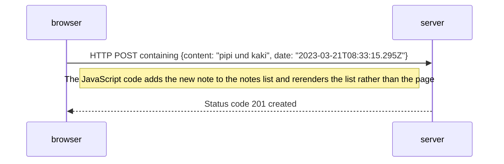

```mermaid
sequenceDiagram
  participant browser
  participant server

  browser->>server: HTTP POST containing {content: "pipi und kaki", date: "2023-03-21T08:33:15.295Z"}
  Note right of browser: The JavaScript code adds the new note to the notes list and rerenders the list rather than the page
  server-->>browser: Status code 201 created
```
